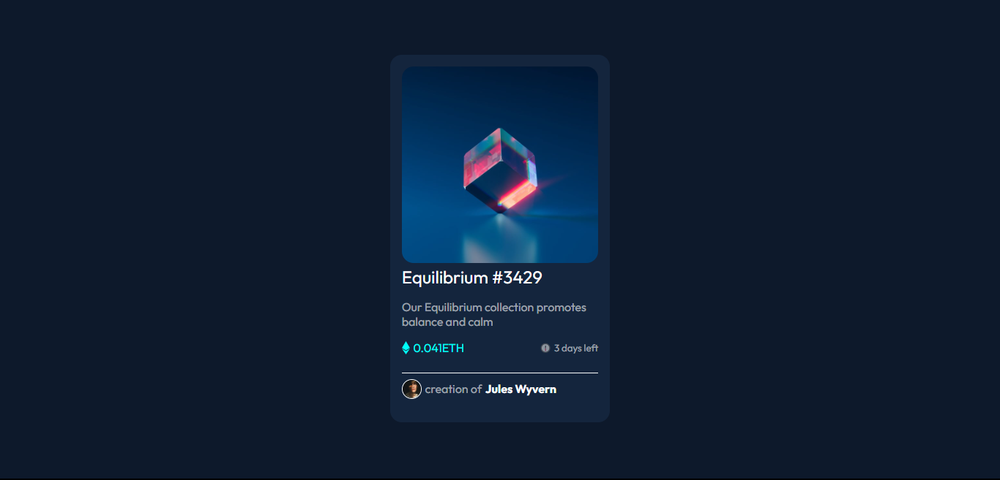

# Frontend Mentor - NFT preview card component solution

This is a solution to the [NFT preview card component challenge on Frontend Mentor](https://www.frontendmentor.io/challenges/nft-preview-card-component-SbdUL_w0U). Frontend Mentor challenges help you improve your coding skills by building realistic projects. 

## Table of contents

- [Overview](#overview)
  - [The challenge](#the-challenge)
  - [Screenshot](#screenshot)
  - [Links](#links)
- [My process](#my-process)
  - [Built with](#built-with)
  - [What I learned](#what-i-learned)
- [Author](#author)

## Overview

### The challenge

Users should be able to:

- View the optimal layout depending on their device's screen size
- See hover states for interactive elements

### Screenshot



### Links

- Solution URL: [Add solution URL here](https://franklivania-nft-preview-card.netlify.app/)
- Live Site URL: [Add live site URL here](https://franklivania-nft-preview-card.netlify.app/)

## My process

### Built with

- Semantic HTML5 markup
- CSS custom properties
- Flexbox
- CSS Grid
### What I learned

I learned how to use the `+` which is the `adjacent sibling connector` in css. I used it in giving life to the hover effect on the image

```
main figure span{
    position: absolute;
    top: 0;
    left: 0;
    width: 100%;
    height: 100%;
    background: var(--tr-cyan);
    display: none;
    transition: .3s ease;
    border: 0.02em solid var(--ln-blue);
    border-radius: var(--border-radius);
    box-shadow: 0.2em 0.2em 1em var(--ln-blue);
}

main figure span img{
    width: 20%;
}

main figure img:hover + span{
    display: grid;
    place-items: center;
}
```

It was a very good example to use this use case to toggle the hover effect of a particular offset element.

## Author

- Website - [Chibuzo Franklin Odigbo](https://github.com/Franklivania)
- Frontend Mentor - [@Franklivania](https://www.frontendmentor.io/profile/Franklivania)
- Twitter - [@OdigboF](https://www.twitter.com/OdigboF)