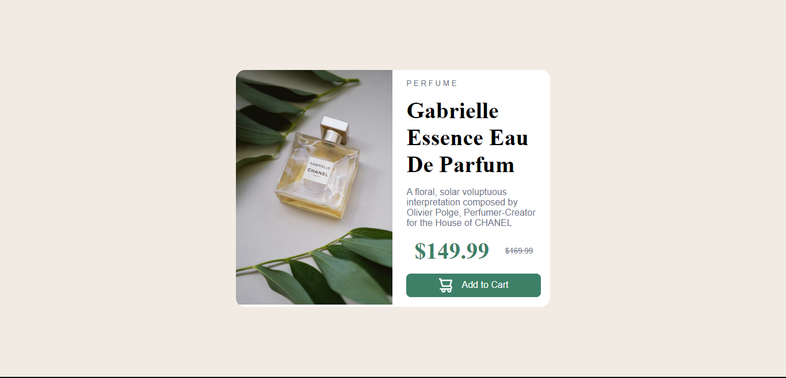

# Frontend Mentor - Product preview card component solution

This is a solution to the [Product preview card component challenge on Frontend Mentor](https://www.frontendmentor.io/challenges/product-preview-card-component-GO7UmttRfa). Frontend Mentor challenges help you improve your coding skills by building realistic projects. 

## Table of contents

- [Overview](#overview)
  - [The challenge](#the-challenge)
  - [Screenshot](#screenshot)
  - [Links](#links)
- [My process](#my-process)
  - [Built with](#built-with)
  - [What I learned](#what-i-learned)
- [Author](#author)
## Overview

### The challenge

Users should be able to:

- View the optimal layout depending on their device's screen size
- See hover and focus states for interactive elements

### Screenshot


### Links

- Solution URL: [Add solution URL here](hhttps://franklivania-product-preview-card-com.netlify.app/)
- Live Site URL: [Add live site URL here](https://franklivania-product-preview-card-com.netlify.app/)

## My process

### Built with

- Semantic HTML5 markup
- CSS custom properties
- Flexbox

### What I learned

Using the picture tag to set images for different screen setups rather than using media queries to handle it

```
<picture>
    <source media="(max-width: 700px)" srcset="images/image-product-mobile.jpg">
    <source media="(min-width: 700px)" srcset="images/image-product-desktop.jpg">
    
</picture>
```

## Author

- Website - [Chibuzo Franklin Odigbo](https://github.com/Franklivania)
- Frontend Mentor - [@Franklivania](https://www.frontendmentor.io/profile/Franklivania)
- Twitter - [@OdigboF](https://www.twitter.com/OdigboF)
