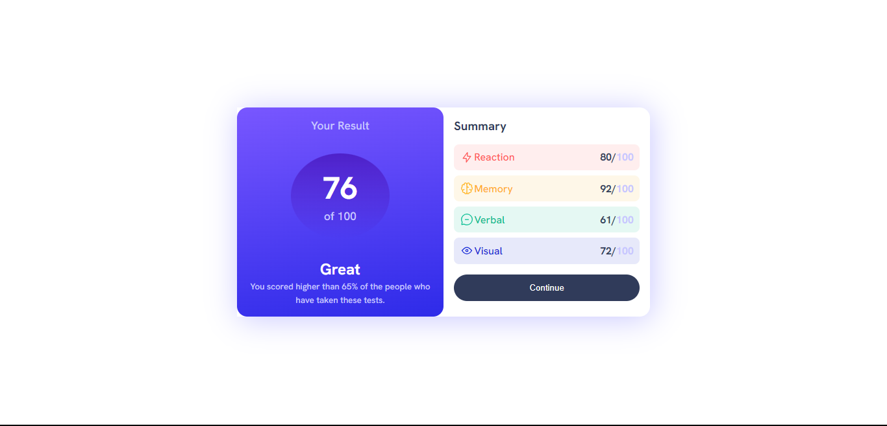

# Frontend Mentor - Results summary component solution

This is a solution to the [Results summary component challenge on Frontend Mentor](https://www.frontendmentor.io/challenges/results-summary-component-CE_K6s0maV). Frontend Mentor challenges help you improve your coding skills by building realistic projects.

## Table of contents

- [Overview](#overview)
  - [The challenge](#the-challenge)
  - [Screenshot](#screenshot)
  - [Links](#links)
- [My process](#my-process)
  - [Built with](#built-with)
  - [What I learned](#what-i-learned)
- [Author](#author)
## Overview

### The challenge

Users should be able to:

- View the optimal layout depending on their device's screen size
- See hover and focus states for interactive elements

### Screenshot


### Links

- Solution URL: [Solution URL](https://franklivania-result-summary-component.netlify.app/)
- Live Site URL: [Live site URL](https://franklivania-result-summary-component.netlify.app/)

## My process

### Built with

- Semantic HTML5 markup
- CSS custom properties
- Flexbox
- CSS pseudo-class and children

### What I learned

How to use the `child` of particular elements to style them, instead of necessarily giving them class names.

```
main section div figure:nth-child(1){
    background: var(--tr-red);
    color: var(--red);
}
main section div figure:nth-child(2){
    background: var(--tr-yellow);
    color: var(--yellow);
}
main section div figure:nth-child(3){
    background: var(--tr-teal);
    color: var(--teal);
}
main section div figure:nth-child(4){
    background: var(--tr-col-blue);
    color: var(--col-blue);
}
```

## Author

- Website - [Chibuzo Franklin Odigbo](https://github.com/Franklivania)
- Frontend Mentor - [@Franklivania](https://www.frontendmentor.io/profile/Franklivania)
- Twitter - [@OdigboF](https://www.twitter.com/OdigboF)
